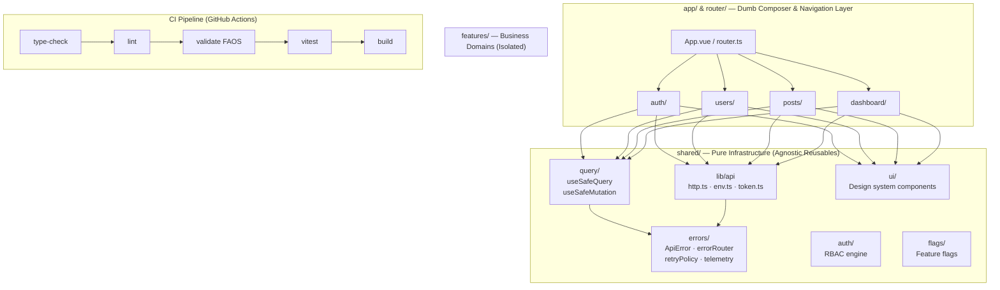

<div align="center">
  
  <h1>Vue 3 Master Template</h1>
  <p>A highly-opinionated, production-ready enterprise template for building scalable Vue applications.</p>

  <div>
    
    
    
    
    
    
    
    
    
    
  </div>
</div>

<hr />

## 🗺️ Architecture Overview (FAOS)



---

## ✨ Features & Capabilities

- **Framework**: [Vue 3.5](https://vuejs.org/) (Composition API, `<script setup>`, TypeScript 5)
- **Bundler**: [Vite 6](https://vitejs.dev/) with ultra-fast HMR and optimized production bundling
- **UI & Styling**: [Tailwind CSS v3.4](https://tailwindcss.com/), `clsx`, `tailwind-merge`, and instant Dark/Light mode switching
- **Server State**: [TanStack Vue Query v5](https://tanstack.com/query/latest) with typed `useSafeQuery` and `useSafeMutation`
- **Client State**: [Pinia v3](https://pinia.vuejs.org/) for auth session and client UI state
- **Runtime Validation**: [Zod](https://zod.dev/) parsing at every API boundary
- **Error Routing**: Typed `ApiError` pipeline with automatic notification toasts and session expiry handling
- **Security & RBAC**: Fine-grained role-based access control engine
- **Component Development**: [Storybook 8](https://storybook.js.org/) (`@storybook/vue3-vite`)
- **Unit & Component Testing**: [Vitest](https://vitest.dev/) + [@vue/test-utils](https://test-utils.vuejs.org/)
- **E2E Testing**: [Playwright](https://playwright.dev/)
- **Architecture Enforcement**: Static boundary scanner (`tools/validate-architecture.mjs`)
- **Git Hygiene**: Commitlint (Conventional Commits), lint-staged, and GitHub Actions CI

---

## 🚀 Quick Start

### 1. Install Dependencies

```bash
npm install
```

### 2. Run Local Development Server

```bash
npm run dev
```

### 3. Run Automated Quality Checks

```bash
# Static architecture boundary check
npm run validate

# TypeScript type checking
npm run type-check

# ESLint check
npm run lint

# Unit & component test suite
npm run test

# Run Storybook component workbench
npm run storybook

# Production build
npm run build
```

---

## 🏛️ Project Structure

```
src/
├── app/                  # Application initialization, root provider, and CSS
├── features/             # Isolated business domain modules
│   ├── auth/             # Authentication, login/register, session store
│   ├── dashboard/        # Analytics, telemetry charts, activity feed
│   ├── users/            # User directory, table, role management
│   └── posts/            # Articles, markdown insights, optimistic CRUD
├── router/               # Typed routing, guards, and RBAC hooks
├── shared/               # Pure agnostic infrastructure & design system
│   ├── api/              # Http client, token storage, endpoint registry
│   ├── auth/             # RBAC engine and permissions
│   ├── config/           # Validated environment configuration
│   ├── errors/           # ApiError, telemetry, error router
│   ├── flags/            # Feature flag composable
│   ├── pagination/       # Pagination utilities
│   ├── query/            # useSafeQuery / useSafeMutation wrappers
│   ├── ui/               # Design system UI components
│   └── utils/            # Helper utilities (cn, etc.)
└── stories/              # Storybook UI documentation
```

---

## 📄 License

MIT © [rmValdez](https://github.com/rmValdez)
