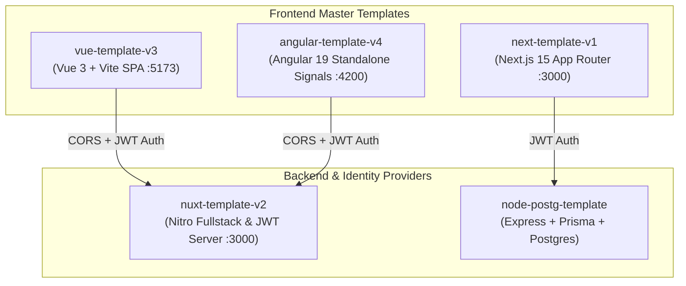

# Enterprise Multi-Template Ecosystem — System Architecture & Standards

This document is the master specification for the entire **`rm-template`** ecosystem, encompassing our production-ready starters across **Next.js**, **Vue 3**, **Nuxt 3**, **Angular 19**, and **Node.js/PostgreSQL**.

---

## 🗺️ Master Ecosystem Overview



---

## 🏛️ Template Comparison Matrix

| Feature / Standard | Next.js (`next-template-v1`) | Vue.js (`vue-template-v3`) | Nuxt.js (`nuxt-template-v2`) | Angular (`angular-template-v4`) |
| :--- | :--- | :--- | :--- | :--- |
| **Framework Version** | Next.js 15 (App Router) | Vue 3.5 (Vite 6) | Nuxt 3.15+ (Nitro SSR) | Angular 19+ (Standalone) |
| **Architecture** | FAOS (3-Tier) | FAOS (3-Tier) | FAOS + Nitro Server | FAOS (3-Tier) |
| **Server State** | TanStack React Query v5 | TanStack Vue Query v5 | Nuxt `useFetch` / Nitro | TanStack Angular Query v5 |
| **Client / UI State** | Zustand v5 | Pinia v3 | Pinia v3 | Angular Signals (`signal()`) |
| **Styling & Theme** | Tailwind CSS v3.4 + HSL | Tailwind CSS v3.4 + HSL | Tailwind CSS v3.4 + HSL | Tailwind CSS v3.4 + HSL |
| **API Contract Validation**| Zod v3/v4 | Zod v3/v4 | Zod v3/v4 | Zod v3/v4 |
| **Package Manager** | `pnpm` 9.x | `pnpm` 9.x | `pnpm` 9.x | `pnpm` 9.x |
| **Testing** | Vitest + Playwright | Vitest + Playwright | Vitest | Karma / Vitest |
| **Component Workshop** | Storybook 8 | Storybook 8 | Tailwind Viewer | Standalone Storybook |

---

## 🔒 Unified Authentication & Security Protocol

Every template in this ecosystem implements the same deterministic security contract:

1. **Authentication Endpoints**:
   - `POST /api/auth/login` → Returns `{ user, accessToken, refreshToken }`
   - `POST /api/auth/register` → Hashes password with `bcryptjs` (10 rounds) & creates tenant
   - `GET /api/auth/me` → Verifies `Authorization: Bearer <accessToken>` and returns identity
   - `POST /api/auth/refresh` → Rotates access/refresh token pair
   - `POST /api/auth/logout` → Clears session tokens

2. **Role-Based Access Control (RBAC)**:
   - **`admin`**: Full system administration, user role elevation, metrics, and settings.
   - **`manager`**: Read and write capabilities for domain content.
   - **`member`**: Standard user workspace interactions and content creation.
   - **`guest`**: Public read-only access.

---

## 📁 Standardized Directory Layout (FAOS Pattern)

Across all templates, code is strictly segregated into three discrete layers:

```
src/
├── app/                  # Top-level composition, providers, router configuration, global CSS
├── features/             # Isolated business domains (auth/, dashboard/, users/, posts/)
│   ├── [feature]/
│   │   ├── api/          # Domain-specific API hooks and queries
│   │   ├── components/   # Feature-specific UI components
│   │   ├── model/        # Types, interfaces, Zod schemas, and stores
│   │   └── views/        # Feature screen/page views
└── shared/               # Reusable agnostic infrastructure
    ├── api/              # Http client, token storage, endpoint constants
    ├── auth/             # RBAC engine and permission definitions
    ├── config/           # Validated environment configuration
    ├── errors/           # ApiError, telemetry, error routers
    ├── ui/               # Design system components (Button, Card, Input, Badge, Table, Modal)
    └── utils/            # Shared utilities (cn.ts, formatters)
```

---

## 🛡️ Boundary Enforcement Rule

A strict static boundary rule is enforced across all templates by `tools/validate-architecture.mjs`:
- **Rule 1**: `shared/` can never import from `features/` or `app/`.
- **Rule 2**: `features/A` can never import from `features/B`. Features can only be composed in `app/` or share utilities via `shared/`.
- **Rule 3**: `app/` contains zero business logic; it only maps routes and provides root layout shells.
