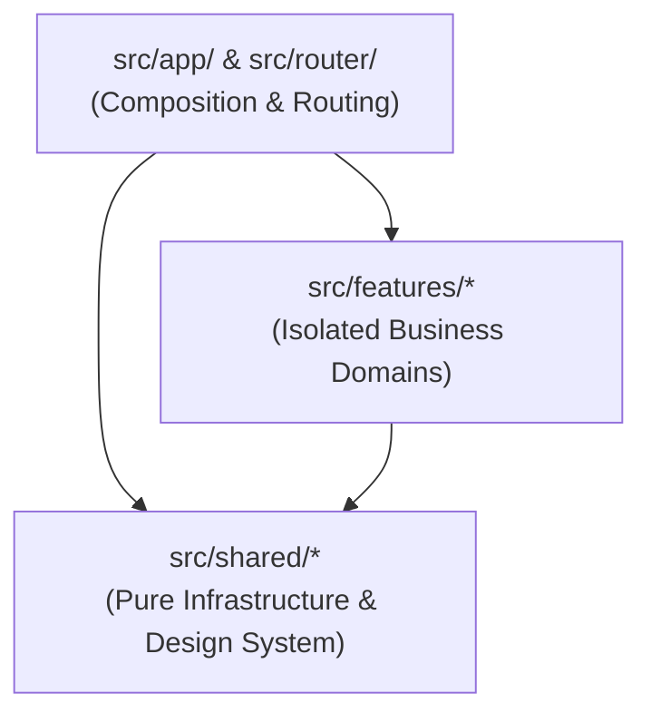

# Vue 3 Engineering Handbook & Architectural Standard

This handbook serves as the definitive source of truth for architectural boundaries, design patterns, and philosophies of the **Vue 3 Master Template (`vue-template-v3`)**.

---

## 1. Architectural Philosophy

This project is a high-performance **Feature-Architecture Oriented (FAOS)** Single Page Application built on Vue 3 and Vite.

- **Predictability over abstraction**: Explicit TypeScript contracts validated by Zod at every API boundary.
- **Composition API with `<script setup>`**: Modern composable hooks for clean logic reuse and zero boilerplate.
- **Strict Layer Isolation**: Strict 3-tier boundary between `app/` (composition), `features/` (business domains), and `shared/` (infrastructure).
- **Dual State Segregation**: Server State is managed with `@tanstack/vue-query`, while Client UI & Session state is encapsulated in `pinia`.

---

## 2. The 3-Tier Layered Architecture

### `src/app/` & `src/router/` (The Composition Layer)
- Maps URLs to feature views and establishes global providers (QueryClient, Pinia, Toaster).
- **Rule**: Never implements business logic directly. Composes views from `src/features/`.

### `src/features/` (The Business Domains)
- Self-contained domain modules (`auth/`, `dashboard/`, `users/`, `posts/`).
- **Rule**: **Strict Feature Isolation**. `features/A` must NEVER import from `features/B`. Communication happens via `app/` composition or `shared/` contracts. Enforced by `tools/validate-architecture.mjs`.

### `src/shared/` (The Global Infrastructure)
- Generic UI design system components (`Button`, `Card`, `Input`, `Badge`, `Modal`, `Table`).
- Networking client (`http.ts`), error classification (`ApiError`), retry policies, token storage, and RBAC evaluator.
- **Rule**: Must have zero knowledge of specific business domains.

---

## 3. Data Flow & State Management

**Rule: TanStack Vue Query owns Server State. Pinia owns UI & Session State.**

1. **Server State (API Data)**: Must only be fetched, cached, and synced using `@tanstack/vue-query` via typed `useSafeQuery` and `useSafeMutation`.
2. **Client State**: Authentication session tokens and UI state are managed in `pinia` stores.
3. **Data Fetching Pipeline**:
   `Component` → `useSafeQuery / useSafeMutation` → `Feature API Hook` → `http.ts` → `Backend API`
