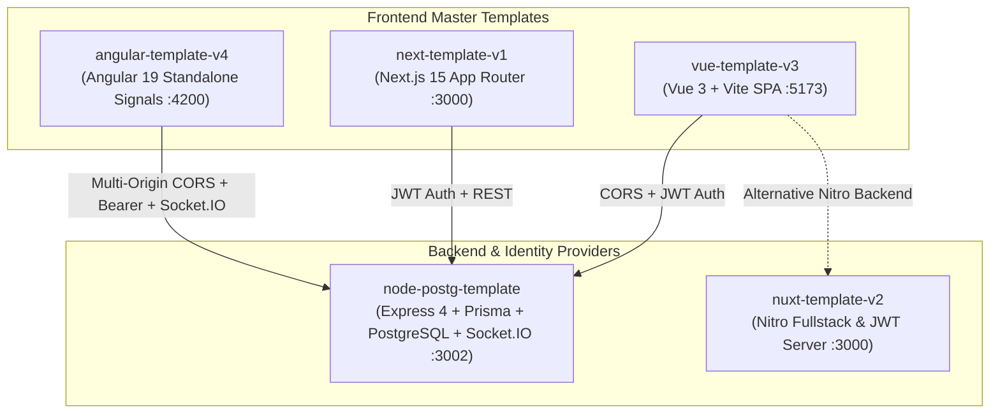

# Enterprise Multi-Template Ecosystem — System Architecture & Standards

This document is the master specification for the entire **`rm-template`** ecosystem, encompassing our production-ready starters across **Angular 19**, **Next.js 15**, **Vue 3**, **Nuxt 3**, and **Node.js/PostgreSQL** (with production patterns extracted from `mapanytime-api`).

---

## 🗺️ Master Ecosystem Overview



---

## 🏛️ Template Comparison Matrix

| Feature / Standard | Angular 19 (`angular-template-v4`) | Node.js / Postgres (`node-postg-template`) | Next.js (`next-template-v1`) | Vue.js (`vue-template-v3`) | Nuxt.js (`nuxt-template-v2`) |
| :--- | :--- | :--- | :--- | :--- | :--- |
| **Framework Version** | Angular 19.1+ (Standalone) | Express 4.18+ / Node 20+ | Next.js 15 (App Router) | Vue 3.5 (Vite 6) | Nuxt 3.15+ (Nitro SSR) |
| **Port (Local Dev)** | `http://localhost:4200` | `http://localhost:3002` | `http://localhost:3000` | `http://localhost:5173` | `http://localhost:3000` |
| **Architecture** | FAOS (3-Tier) | Controller-Service-Repo + Sockets | FAOS (3-Tier) | FAOS (3-Tier) | FAOS + Nitro Server |
| **Server State** | TanStack Angular Query v5 | Prisma ORM 6.x + Redis Cache | TanStack React Query v5 | TanStack Vue Query v5 | Nuxt `useFetch` / Nitro |
| **Client State / Storage** | Angular Signals (`sessionStorage`) | In-Memory / Redis Sessions | Zustand v5 (`sessionStorage`) | Pinia v3 | Pinia v3 |
| **Realtime WebSockets** | Socket.IO Client / WebSocket | Socket.IO 4.8+ Gateway | Socket.IO Client / SSE | Socket.IO Client | Nitro WebSockets |
| **Styling & Theme** | Tailwind CSS v3.4 + HSL | N/A (JSON API & WebSocket) | Tailwind CSS v3.4 + HSL | Tailwind CSS v3.4 + HSL | Tailwind CSS v3.4 + HSL |
| **Contract Validation**| Zod v3.24 | Joi / Zod | Zod v3/v4 | Zod v3/v4 | Zod v3/v4 |

---

## 🔒 Unified Authentication & Token Protocol

Every template in this ecosystem implements the same deterministic security contract:

1. **Authentication Endpoints (`/api/v1/auth/*`)**:
   - `POST /api/v1/auth/login` → Validates credentials and returns `{ status: "success", statusCode: 200, data: { user, accessToken, refreshToken } }`
   - `POST /api/v1/auth/register` → Hashes password with PBKDF2 (`salt:hash`) / bcrypt and creates user
   - `GET /api/v1/users/me` → Verifies `Authorization: Bearer <accessToken>` and returns user identity
   - `POST /api/v1/auth/refresh-token` → Validates refresh token and returns refreshed `accessToken`
   - `POST /api/v1/auth/logout` → Invalidates database session and clears Redis cache

2. **Token Lifecycles & Secrets**:
   - **Access Token Expiry**: `15m` (Short-lived, stored in browser `sessionStorage`)
   - **Refresh Token Expiry**: `7d` (Long-lived session rotation in database `Session` model)
   - **Access Token Secret**: `ACCESS_TOKEN_SECRET`
   - **Refresh Token Secret**: `REFRESH_TOKEN_SECRET`

3. **Role-Based Access Control (RBAC)**:
   - **`SUPER_ADMIN` / `ADMIN`**: Full system administration, metric telemetry, user role elevations.
   - **`DEVELOPER` / `MANAGER`**: System observability, API inspection, domain content management.
   - **`USER` / `MEMBER`**: Standard workspace access and domain creation.
   - **`GUEST`**: Public read-only access.

---

## 🏢 Unified Multi-Tenant Architecture

Every template connects to the centralized PostgreSQL backend with tenant isolation:

1. **Tenant Identification**:
   - Outgoing frontend requests attach `x-tenant-id` HTTP header (e.g. `x-tenant-id: angular-v4`, `x-tenant-id: next-v1`, `x-tenant-id: vue-v3`, `x-tenant-id: nuxt-v2`).
   - The Express middleware (`tenant.middleware.ts`) automatically extracts the tenant slug and injects `req.tenant` into all downstream services.

2. **Database Isolation (`Tenant` Model)**:
   - All domain resources (`AngularTopic`, `User`, workspaces) are scoped by `tenantId`.
   - Allows clean multi-frontend coexistence without data collisions or separate server instances.

---

## ⚡ Backend Architecture Standards (`node-postg-template`)

The backend incorporates production patterns from `mapanytime-api`:

### 1. Unified Multi-Origin CORS (`src/middleware/cors.middleware.ts`)
- **Shared Allowlist**: Express HTTP routes and Socket.IO gateway share the same allowlist parser.
- **Dynamic Config**: Reads comma-separated origins from `CORS_ORIGIN` (e.g. `http://localhost:4200,http://localhost:3000,http://localhost:5173`).
- **Browser Spec Compliance**: Avoids wildcard `*` with `credentials: true` to prevent browser CORS rejections.

### 2. Realtime Socket.IO Gateway (`src/infrastructure/socket/index.ts`)
- **User Isolation**: Automatic user notification rooms (`notifications:user:${userId}`).
- **Dynamic Rooms**: Generic room join/leave (`join_room`, `leave_room`).
- **Helper Methods**: `emitNotificationToUser()`, `emitToRoom()`, `emitBroadcast()`.

### 3. Standardized Pagination Helper (`src/helpers/pagination.helper.ts`)
```typescript
const { page, limit, skip, sortBy, sortOrder, search } = parsePagination(req.query);
const [items, total] = await Promise.all([
  prisma.user.findMany({ where, skip, take: limit }),
  prisma.user.count({ where }),
]);
return responseSuccess(res, 200, buildPage(items, total, { page, limit, sortBy, sortOrder, search }));
```

**Standard Envelope:**
```json
{
  "status": "success",
  "statusCode": 200,
  "data": {
    "items": [ ... ],
    "total": 100,
    "page": 1,
    "limit": 20,
    "totalPages": 5
  },
  "message": "Items retrieved successfully"
}
```

### 4. Typed Response Helpers (`src/helpers/response.helper.ts`)
- `responseSuccess(res, statusCode, data, message?)`
- `responseError(res, statusCode, message, extra?)`

### 5. Distributed Request Context (`src/utils/async-context.ts`)
- Leverages Node.js `AsyncLocalStorage` to trace `requestId` and `correlationId` across handlers, database queries, and loggers.

### 6. Geospatial Utilities (`src/utils/geo.util.ts`)
- Pure, deterministic `haversineKm(lat1, lng1, lat2, lng2)` calculation for location proximity and spatial bounding.

### 7. Connection-Pooled Email Service (`src/utils/mailer.util.ts`)
- **Nodemailer Transport Pool**: Reuses single connection pool across requests.
- **Verification at Startup**: `verifyMailer()` checks SMTP configuration at boot without throwing fatal crashes.
- **HTML & Plain Text**: Full support for rich email notifications, password resets, and verification codes.
- **Ethereal Dev Previews**: Automatically prints web preview links in development mode.

---

## 🅰️ Frontend Architecture Standards (`angular-template-v4`)

### 1. Modern Angular 19 Features
- **Standalone Architecture**: 100% standalone components, directives, and pipes. Zero `NgModule`.
- **Native Reactivity (Signals)**: Component state managed with `signal()`, `computed()`, and `effect()`.
- **Built-in Control Flow**: `@if`, `@else`, `@for (item of items; track item.id)`, `@switch`.
- **Token Security**: Tokens are isolated to `sessionStorage` via `TokenService`.

### 2. Functional HTTP Interceptor (`src/app/core/interceptors/auth.interceptor.ts`)
- Automatically attaches `Authorization: Bearer <accessToken>` to outgoing requests.
- Prioritizes `/auth/refresh-token` requests to attach the refresh token without early return conflicts.

---

## 📁 Standardized Directory Layout (FAOS Pattern)

Across all frontend templates, code is strictly segregated into three discrete layers:

```
src/
├── app/                  # Top-level composition, providers, router configuration, global CSS
├── features/             # Isolated business domains (auth/, dashboard/, users/, posts/)
│   ├── [feature]/
│   │   ├── api/          # Domain-specific API hooks and queries
│   │   ├── components/   # Feature-specific UI components
│   │   ├── model/        # Types, interfaces, Zod schemas, and stores
│   │   └── views/        # Feature screen/page views
└── shared/               # Reusable agnostic infrastructure
    ├── api/              # Http client, token storage (sessionStorage), endpoint constants
    ├── auth/             # RBAC engine and permission definitions
    ├── config/           # Validated environment configuration
    ├── errors/           # ApiError, telemetry, error routers
    ├── ui/               # Design system components (Button, Card, Input, Badge, Table, Modal)
    └── utils/            # Shared utilities (cn.ts, formatters)
```

---

## 🛡️ Boundary Enforcement Rule

A strict static boundary rule is enforced across all templates by `tools/validate-architecture.mjs`:
- **Rule 1**: `shared/` can never import from `features/` or `app/`.
- **Rule 2**: `features/A` can never import from `features/B`. Features can only be composed in `app/` or share utilities via `shared/`.
- **Rule 3**: `app/` contains zero business logic; it only maps routes and provides root layout shells.
