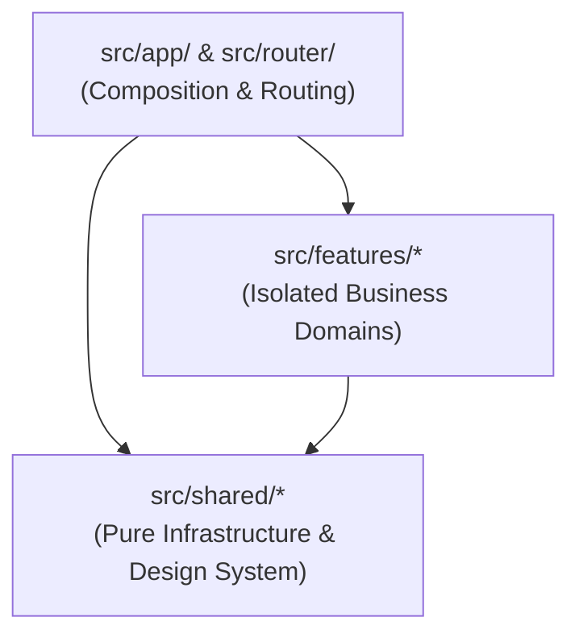

# Architecture Guide — Feature-Architecture Oriented Structure (FAOS)

This template enforces **FAOS (Feature-Architecture Oriented Structure)** to prevent monolithic degradation, maintain clean boundaries, and support seamless parallel development.

---

## 🏗️ 3-Tier Layered Design



### 1. `src/app/` & `src/router/` (Dumb Composition & Routing)

- Initializes plugins (Pinia, TanStack Vue Query, Vue Router).
- Orchestrates top-level application shell and route configuration.
- Does not contain business logic or domain entity manipulation directly.

### 2. `src/features/` (Isolated Business Domains)

- Self-contained domains (e.g. `auth/`, `dashboard/`, `users/`, `posts/`).
- Contains domain models, Zod validation schemas, domain API clients, Vue components, and views.
- **Rule**: Features MUST NEVER import directly from sibling features. Interaction between features is composed in the `app` or `router` layer.

### 3. `src/shared/` (Infrastructure & Reusables)

- Agnostic design system components (`Button`, `Card`, `Input`, `Table`, `Modal`).
- Networking client (`http.ts`), error classification (`ApiError`), retry policy, telemetry.
- Query abstractions (`useSafeQuery`, `useSafeMutation`), token manager, RBAC evaluator.
- **Rule**: The shared layer cannot depend on `features` or `router`.

---

## 🛡️ Static Architecture Validation

Run boundary compliance checks anytime with:

```bash
npm run validate
```

The script `tools/validate-architecture.mjs` scans all imports across the codebase and prevents circular dependencies or layer leaks before CI and commits.
